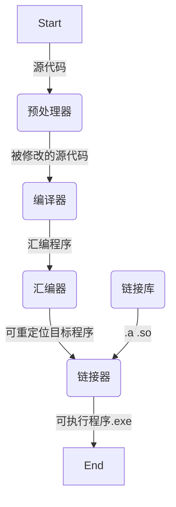

# 软件构建过程与编程规范建议

## 软件构建过程

### 引入

在之前的视觉绪论课之后的“ForBeginner”中，我给大家准备了一个OpenCVExample和OpenCV的库。

但是这两个东西却可以被随意地放在系统中的任何两个地方，代码仍然能够调用到OpenCV库所提供的图像处理函数。

那么代码是怎么找到OpenCV的呢？我们的程序中并没有OpenCV函数的源代码，我们又是怎么去调用的这些库函数？

其实这就是那份CMakeLists.txt的功劳，在我们拿到OpenCVExample之后，我们可以不用修改任何代码直接运行，却需要修改CMakeLists.txt中的路径为OpenCV实际保存的路径。否则就会报找不到OpenCV库的错误。

CMakeLists.txt便是CMake这一构建系统用来配置项目的描述文件。

在认识CMake之前，我们需要先了解一下我们写的代码是如何变成程序的。

### 从代码到程序

显然，计算机是没办法直接看懂你写的代码的，他只能理解最基本的二进制文件(exe)。

那么就需要一个从代码一步步变成二进制的过程。



预处理器指令、编译器求值


我们注意到在链接器这一步，由我们的程序所编译而来的可重定位目标程序会和以`.a || .so`为后缀的链接库进行链接，如果我们去看一下我们电脑上的OpenCV库，我们会发现在 `x64\mingw\lib` 目录下存放了许多就是.a为后缀的**静态链接库**。那么其实，OpenCV的具体实现代码，正是提前编译成了这些.a文件，并被我们的程序所链接来调用的。

而在大型项目中，一个程序不会只有一个`main.cpp`，还会有许许多多自己编写的`.h`和`.cpp`库文件，里面存放着由我们编写好的函数和类等代码。而我们的`main.cpp`通常只会包含需要的`.h`文件，而实际定义的代码则存放在`.cpp`里。这些`.h`才会成为`main.cpp`代码的一部分，而相应的`.cpp`文件其实也是经过汇编器生成`.obj`文件，再由链接器与`main.c`的编译结果进行链接。

### 按下“构建”按钮后的幕后助手们

编译并不是一个简单的过程，在这个过程中，需要一系列的工具参与才能够顺利进行。

我们的CLion中内置了一套工具链，它叫 `MinGW` 。

MinGW其实是Linux上的GCC在Windows上的移植版。

注意，它其实是一个工具链，也就是说是由一系列工具组成的，其中主要包括负责C++项目构建的`Make`，负责整个C++程序编译过程的`g++`，负责提供调试功能的`gdb`。

而在这里，负责构建C++项目的是`Make`，与它相关的文件是`Makefile`。它负责的是将一个C++项目要使用的所有库文件、源文件、链接库等东西组织起来，并指导`g++`完成编译过程。

但是`Make`的语法有些......晦涩难懂，并且不便于编写。于是人们将`Make`的语法抽象出来，形成了一个称为`CMake`的构建工具。`CMake`提供更为简单通俗的语法来构建一个项目，但其实本质还是由`CMake`生成`Makefile`，再有`Make`完成构建。

而CLion也正是利用了CMake识别并管理项目。因此，用CLion打开的代码必须要在根目录包含CMakeLists.txt。也不建议直接用CLion去直接打开`main.cpp`，因为这样做CLion不会去尝试寻找CMakeLists.txt，而需要直接通过`打开...`打开整个目录。

### why CMake

我们可以直接指导编译工具完成编译过程。

- 例如当我们只有一个`main.cpp`需要编译时：
```bash
g++ main.cpp
```

- 当我们的项目逐渐庞大，有许许多多库文件时，也不是不能用。
```bash
g++ main.cpp core/common.cpp core/definition.cpp core/core.cpp io/console.cpp io/file.cpp ui/base_ui.cpp ui/ui.cpp ui/ui_string.cpp ......
```
能用，但不多。

- 而当我们的程序还需要调用一些第三方库，例如OpenCV、Boost、Eigen的时候，情况就更加复杂了。这个时候仅仅使用单纯的直接调用g++显然不能完成我们的需求。

- 而CMake，提供了简单的便于编写的语法，来让我们可以方便地管理C++项目构建、多文件编译、管理外部依赖、代码模块化、编译结果安装等。


### 从几个例子出发

- 我们先来看看一个CMakeLists.txt的最小组成

```cmake
cmake_minimum_required(VERSION 3.19)       # 指定支持的最低CMake版本

project(HelloWorld)                        # 指定项目名

add_executable(HelloWorld main.cpp)        # 指示CMake创建一个新目标：可执行文件HelloWorld。这个可执行文件是通过编译和链接源文件main.cpp生成的。
```

- 当项目包含了许多我们编写的库文件时

```cmake
cmake_minimum_required(VERSION 3.22)
project(CFinalWork)

set(CMAKE_CXX_STANDARD 11)

aux_source_directory(./src SRC_FILES)           # 让CMake在指定路径搜索所有源文件，并将源文件列表存放到变量中
aux_source_directory(./src/Core CORE_SRC_FILES)
aux_source_directory(./src/Data DATA_SRC_FILES)
aux_source_directory(./src/IO IO_SRC_FILES)
aux_source_directory(./src/UI UI_SRC_FILES)
aux_source_directory(./src/User USER_SRC_FILES)

add_executable(${PROJECT_NAME} ${SRC_FILES} ${CORE_SRC_FILES} ${DATA_SRC_FILES} ${IO_SRC_FILES} ${UI_SRC_FILES} ${USER_SRC_FILES})
```

- 当项目需要链接OpenCV时

```cmake
cmake_minimum_required(VERSION 3.21)        # 指定支持的最低CMake版本
project(OpenCVExample)                      # 指定项目名

set(OpenCV_DIR "D:/OpenCV/")                # 设置OpenCV路径
find_package(OpenCV REQUIRED)               # 搜索OpenCV包
include_directories(${OpenCV_INCLUDE_DIRS}) # 包含OpenCV头文件

add_executable(${PROJECT_NAME} main.cpp)    # 指示CMake创建目标

target_link_libraries(${PROJECT_NAME} ${OpenCV_LIBS}) # 链接OpenCV库
```

- 一个真正的大项目

```cmake
cmake_minimum_required(VERSION 3.22)
project(infantry_visual)

set(CMAKE_CXX_STANDARD 17)

if (CMAKE_SYSTEM_NAME MATCHES "Windows") # WINDOWS
    set(OpenCV_DIR "D:/000-XianYuHil/Programming/WPIE/RMIntelligentVision/OpenCV")
    set(Eigen_DIR "D:/000-XianYuHil/Programming/WPIE/RMIntelligentVision/Eigen")
    message(STATUS "Windows mode.")
else () # LINUX
    set(Eigen3_INCLUDE_DIRS "/usr/local/include/eigen3/")
    add_library(GXCamera SHARED IMPORTED)
    set_target_properties(
            GXCamera
            PROPERTIES IMPORTED_LOCATION
            /usr/lib/libgxiapi.so
    )
endif ()

find_package(OpenCV REQUIRED)
find_package(Eigen3 REQUIRED)
include_directories(${OpenCV_INCLUDE_DIRS})
include_directories(${Eigen3_INCLUDE_DIRS})
message(STATUS "已引入外部库OpenCV、Eigen、GxCamera")

##pThread库
# set(CMAKE_CXX_FLAGS "${CAMKE_CXX_FLAGS} -std=c++2a")

include_directories(src)
aux_source_directory(src DIR_SRC)
include_directories(src/Anglesolve)
aux_source_directory(src/Anglesolve DIR_ANGLESOLVE)
include_directories(src/ArmorDetector)
aux_source_directory(src/ArmorDetector DIR_ARMORDETECTOR)
include_directories(src/General)
aux_source_directory(src/General DIR_GENERAL)
include_directories(src/General/FFT)
aux_source_directory(src/General/FFT DIR_GENERAL_FFT)
include_directories(src/General/Kalman)
aux_source_directory(src/General/Kalman DIR_GENERAL_KALMAN)
include_directories(src/GxCamera)
aux_source_directory(src/GxCamera DIR_GXCAMERA)
include_directories(src/GxCamera/include)
aux_source_directory(src/GxCamera/include DIR_GXCAMERA_INCLUDE)
include_directories(src/Predict)
aux_source_directory(src/Predict DIR_PREDICT)
include_directories(src/Serial)
aux_source_directory(src/Serial DIR_SERIAL)
include_directories(src/ThreadControl)
aux_source_directory(src/ThreadControl DIR_THREADCONTROL)
include_directories(src/Trajectory)
aux_source_directory(src/Trajectory DIR_TRAJECTORY)
include_directories(src/util)
aux_source_directory(src/util DIR_UTIL)
include_directories(src/Recorder)
aux_source_directory(src/Recorder DIR_RECORDER)
include_directories(src/Debugger)
aux_source_directory(src/Debugger DIR_DEBUGGER)
include_directories(src/Debugger/web_debugger)
aux_source_directory(src/Debugger/web_debugger DIR_DEBUGGER_WEB_DEBUGGER)

include_directories(./src/Debugger/web_debugger/json/json)

add_executable(infantry_visual
        ${DIR_ANGLESOLVE}
        ${DIR_ARMORDETECTOR}
        ${DIR_GENERAL}
        ${DIR_GENERAL_FFT}
        ${DIR_GENERAL_KALMAN}
        ${DIR_GXCAMERA}
        ${DIR_GXCAMERA_INCLUDE}
        ${DIR_PREDICT}
        ${DIR_SERIAL}
        ${DIR_THREADCONTROL}
        ${DIR_TRAJECTORY}
        ${DIR_UTIL}
        ${DIR_SRC}
        ${DIR_RECORDER}
        ${DIR_DEBUGGER}
        ${DIR_DEBUGGER_WEB_DEBUGGER}

        src/Debugger/web_debugger/json/jsoncpp.cpp
        )

if (CMAKE_SYSTEM_NAME MATCHES "Windows")
    target_link_libraries(${PROJECT_NAME}
            ${OpenCV_LIBS}
            pthread ws2_32)
else ()
    target_link_libraries(${PROJECT_NAME}
            ${OpenCV_LIBS}
            # ${Boost_LIBRARIES}
            GXCamera
            pthread)
endif ()
```

### CMake常见命令介绍

#### 指定最低支持CMake版本

```cmake
cmake_minimum_required(VERSION <min>)
```

#### 给工程起个名字

```cmake
project(<PROJECT-NAME> [LANGUAGES] [<language-name>...])
```

#### 让CMake找到我的头文件

```cmake
include_directories([AFTER|BEFORE] [SYSTEM] dir1 [dir2 ...])
```

#### 让CMake找到我的源文件

```cmake
aux_source_directory(<dir> <variable>)
```
#### 让CMake找到我的库文件

```cmake
link_directories(directory1 directory2 ...)
```

#### 告诉CMake我的构建目标

```cmake
add_executable(<name> [WIN32] [MACOSX_BUNDLE] [EXCLUDE_FROM_ALL] source1 [source2 ...])
```

#### 告诉CMake我要链接哪个库文件

```cmake
target_link_libraries(<target> [item1 [item2 [...]]] [[debug|optimized|general] <item>] ...)
```

### 相关教程

- https://sjtu-robomaster-team.github.io/vision-learning-4-cmake-introduction/
- https://www.bookstack.cn/read/CMake-Cookbook/README.md
- https://elloop.github.io/tools/2016-04-10/learning-cmake-2-commands