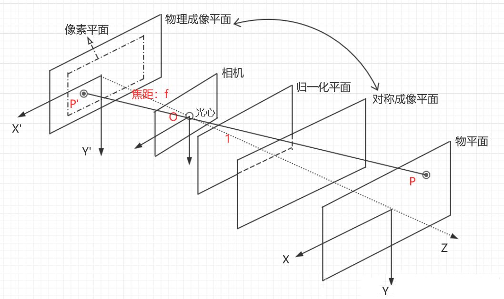
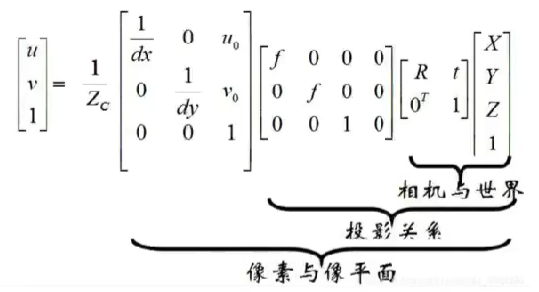
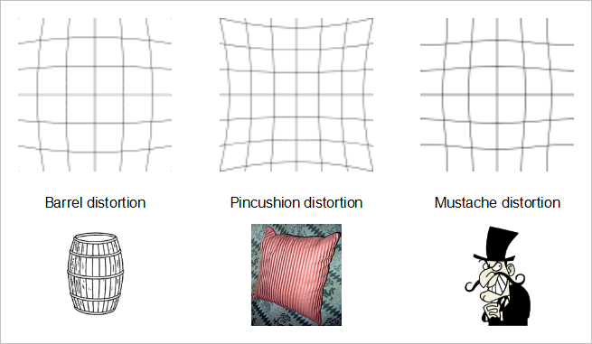
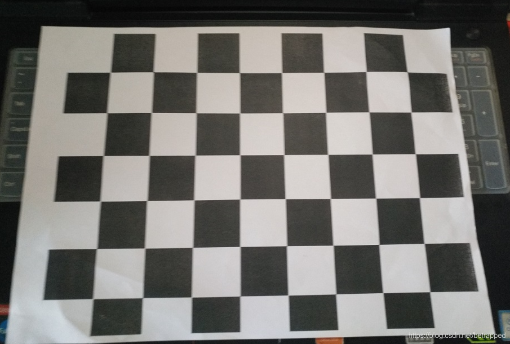
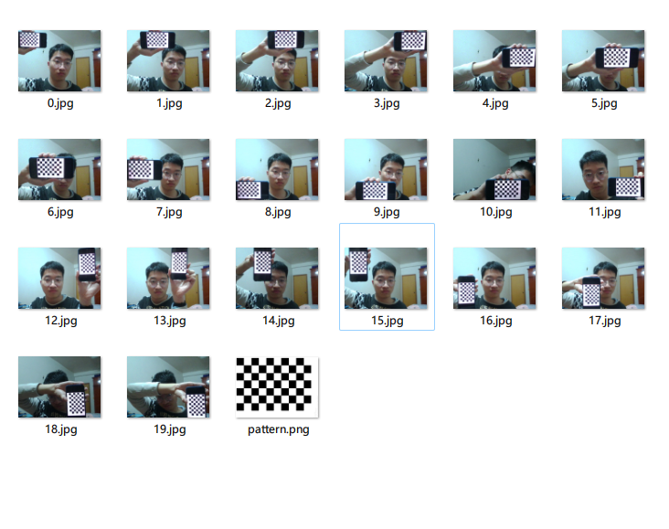
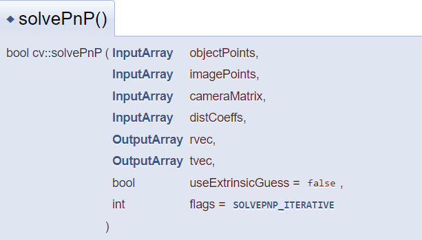
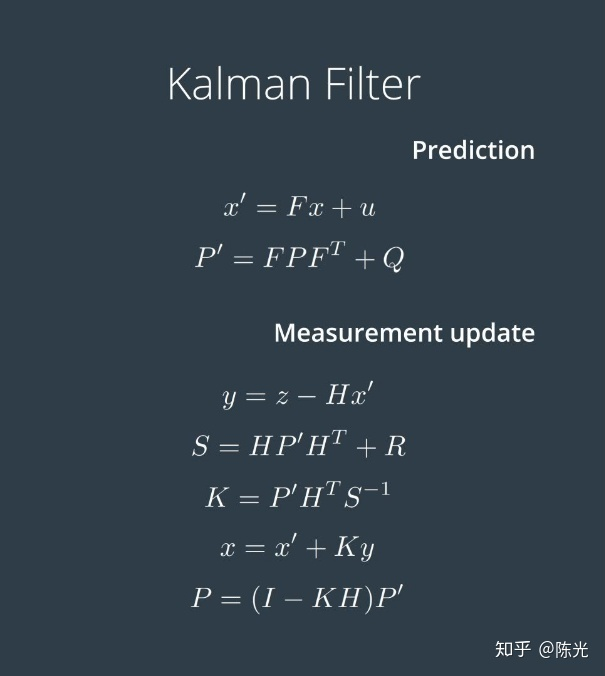

# 相机与单目视觉解算与卡尔曼滤波

## 镜头与相机

### 相机种类

- 工业相机
  - 帧数较高，相机性能好，通常用于一般的视觉识别、解算程序
  - 大恒工业相机
- USB相机
  - 无需安装任何驱动，即插即用

### 镜头

- 焦距
  - 焦距决定了相机适合观察什么距离的物体，短焦一般适合观察近距离物体，长焦一般适合观察远距离物体。
  - 短焦
  - 中焦
  - 长焦
- 视角大小
  - 广角
    - 视角大，可观测范围广。但同时会产生较大畸变。
  - 标准
    - 视角小，但产生的畸变也较小。
  - 一般来说，在没有特殊需求的情况下，镜头选型选择标准镜头。
- 光圈
  - 控制相机进光量
- 光圈焦距调整方式
  - 光圈焦距调整方式
  - 固定光圈定焦镜头
  - 手动光圈定焦镜头
  - 自动光圈定焦镜头
  - 手动变焦镜头
  - 自动变焦镜头
  - ......

### 相机

相机是整个摄像机结构的核心部分，也是感光元件的所在部分。他直接决定了摄像机的许多重要特性。

相机选型时主要关注以下的参数：

- 采样分辨率
  - 即相机采样得到的图像的像素点个数
- 采样最大帧率
  - 即相机一秒最多能拍摄多少张照片，取决于相机采集，传输图像的速率。
  - 一般来说，相机会因为曝光时间限制无法达到最大帧率。
- 像素深度
  - 即每位像素数据的位数，常见的为 8bit。
- 触发方式
  - 即使用什么方式触发相机拍摄一张图片。
  - 常见的触发方式有连续触发，软件触发和硬件触发。
- 接口类型
  - 即相机输出图片的接口类型。
  - 常见的有 USB接口、以太网接口 等。现主要使用的均为USB3.0接口。
- 曝光方式
  - 分为全局曝光和逐行曝光
- 增益
  - 增益可以改变相机的响应曲线，主要用于放大
  - 增益可以提高图像亮度，但也会产生很大的图像噪声
- 曝光时间
  - 感光材料的感光时间，由相机快门控制

## 坐标系

### IMU

惯性测量单元，主要用来检测和测量加速度与旋转运动的传感器。用于视觉程序的IMU通常安装在云台上。

内部包含三个单轴的加速度计和三个单轴的陀螺仪。内部实现细节详询电控组的同学，在此不进行深入讨论。

原始数据在经过电控组进行融合处理与转换之后，会得到IMU原始坐标系下的roll、pitch、yaw轴数据，再发送给视觉组进行使用。


### 像素坐标系

即一张图像中描述像素的坐标系。是一个二维空间中的坐标系。

在OpenCV中向右为$x$轴正方向，向下为$y$轴正方向。

### 相机坐标系

以相机为原点，$z$轴朝前的右手系。在相机发生平移和旋转运动时，相机坐标系和相机一起运动。

必须说明的是，相机坐标系一般为右手系，但其各个坐标轴的朝向可以由使用者自行定义，需要注意与像素坐标系保持一致。（这里由于像素坐标系y轴朝下，故相机坐标系中y轴也朝下）

摄像机的成像公式中,$\left[\begin{matrix}X_c \ Y_c \ Z_c \end{matrix}\right]^T$即为相机坐标系中的点。

相机的成像过程即为将相机坐标系中的点投影到像素坐标系的过程。



### 陀螺仪坐标系

在相机坐标系中有提到，当相机发生旋转运动时，相机坐标系也会随之一起运动。因此，当相机在发生旋转运动时，想要知道物体和相机的相对位置关系变化将会变得更困难。 对此，我们想要找到一个坐标系，在相机旋转时保持不变，这就是陀螺仪参考坐标系。陀螺仪参考系通过固定在相机上的陀螺仪，实时结算相机的位姿，进而得到一个不随相机旋转的坐标系。

由于陀螺仪坐标系和相机坐标系之间的关系为旋转关系，因此陀螺仪参考坐标系中的三个坐标轴的关系与相机坐标系相同。

### 世界坐标系

即使是陀螺仪参考坐标系也会在相机运动是发生平移运动，而世界坐标系是一个与相机没有任何直接关联，建立在外部世界中的一个被认为静止的参考系。

事实上，许多时候视觉定位就是在解算相机坐标系与世界坐标系的相对位置关系。他们两者之间经过了一次平移和一次旋转变换。

世界坐标系的三个坐标轴关系需要与相机坐标系保持一致（同为左手系或者同为右手系），但是世界坐标系的建立可以依据实际问题选择最方便研究的方式建立。

总结一下四个坐标系之间的关系
世界坐标系 – [平移] –> 陀螺仪坐标系 – [旋转] –> 相机坐标系 – [投影] –> 像素坐标系



## 相机畸变与标定

### 相机畸变

- 径向畸变
  - 径向畸变是沿半径方向分部的畸变
  - 其产生原因是光线在远离透镜中心的地方比靠近中心的地方更加弯曲



- 切向畸变
  - 切向畸变是大体上是关于一条中心轴对称的
  - 其产生原因是由于透镜本身与传感器平面不平行导致的

径向畸变与切向畸变均有各自的数学模型，其中一共使用了5个参数用于描述畸变，我们称之为**畸变参数**。其中具体的数学模型我们在此不做过多深入，感兴趣的请自行了解。

相机的畸变主要为径向畸变，带有轻微的切向畸变。

### 相机标定

通过标定板，我们可以得到n个世界坐标系下的三维点和与之对应的图像坐标系下的二维点。

而它们之间的关系可以通过上面提到的 相机内参、相机外参和畸变参数 经过一系列的变换得到。

因此相机标定的本质就是代入已知的对应关系，通过求解方程组来得到 相机内参和畸变参数 的过程。

其中具体的数学细节我们在此不做过多深入，感兴趣的请自行了解。



通常使用的相机标定工具有：

- Matlab
- OpenCV
  - `double cv::calibrateCamera()`

我们目前更经常使用的标定工具是Matlab。



## 单目视觉解算

在相机标定中，我们是已知一系列世界坐标系中的三维点和与之对应的图像坐标系下的二维点，求解 相机内参和畸变参数 。

而在单目视觉解算中，我们是已知 一系列世界坐标系中的三维点和与之对应的图像坐标系下的二维点、相机内参和畸变函数 ，求解相机外参，也就是旋转矩阵和平移矩阵。

其中在解算时的世界坐标系，通常是以目标的中心点为原点进行建立的。

### PnP解算

PNP算法通过至少四个点的约束，来估计相机位姿，求出世界坐标系到相机坐标系的旋转矩阵和平移向量。



其中

- objectPoints
  - 世界坐标系中的点
- imagePoints
  - 像素坐标系中的点
- cameraMatrix
  - 相机内参
- disCoeffs
  - 相机畸变矩阵
- rvec
  - 求出来的旋转向量
- tvec
  - 求出来的平移向量

通过求解出来的旋转矩阵和平移矩阵，我们也就能计算出目标到相机的位置和距离关系。

## 卡尔曼滤波

### 数学原理



具体数学细节请自行了解。

我们通过输入上一时刻的状态$x_{k-1}$和这一时刻的观测$z$，通过给定的预测方差$R$与观测方差$Q$，更新卡尔曼增益，进而得到估算的这一时刻的状态$x$。这就是这一组公式的内在含义。

### 实现

#### OpenCV

```cpp
class CV_EXPORTS_W KalmanFilter
{
public:  
    KalmanFilter(); //构造默认KalmanFilter对象
    KalmanFilter(int dynamParams, int measureParams, int controlParams=0, int type=CV_32F); //完整构造KalmanFilter对象方法
    void init(int dynamParams, int measureParams, int controlParams=0, int type=CV_32F); //初始化KalmanFilter对象，会替换原来的KF对象

    const Mat& predict(const Mat& control=Mat()); //计算预测的状态值
    const Mat& correct(const Mat& measurement); //根据测量值更新状态值

    Mat statePre;            //预测值 (x'(k)): x(k)=A*x(k-1)+B*u(k)
    Mat statePost;           //状态值 (x(k)): x(k)=x'(k)+K(k)*(z(k)-H*x'(k))
    Mat transitionMatrix;    //状态转移矩阵 (A)
    Mat controlMatrix;       //控制矩阵 B
    Mat measurementMatrix;   //测量矩阵 H
    Mat processNoiseCov;     //系统误差 Q
    Mat measurementNoiseCov; //测量误差 R
    Mat errorCovPre;         //最小均方误差 (P'(k)): P'(k)=A*P(k-1)*At + Q)
    Mat gain;                //卡尔曼增益   (K(k)): K(k)=P'(k)*Ht*inv(H*P'(k)*Ht+R)
    Mat errorCovPost;        //修正的最小均方误差 (P(k)): P(k)=(I-K(k)*H)*P'(k)

    // ......
}
```

#### 自行实现

### 不足

- 卡尔曼滤波有马尔可夫性，只考虑了上一个时间节点，而并没有考虑$0 \to k-1$项数据的特征
- 卡尔曼滤波在只适用于线性模型，而对于非线性模型并没有良好的效果

对于第一条不足，我们有对应的优化类算法解决 对于第二条不足，后来者对卡尔曼滤波进行了各种改良，创造了EKF(拓展卡尔曼滤波)，UKF(无迹卡尔曼滤波)等不同的卡尔曼滤波算法。

## Eigen

在视觉组解算和预测的工作部分中，经常需要使用矩阵、向量等数学工具。为了更加方便我们进行相关的计算，我们可以像引入 `OpenCV` 用于计算机视觉一样，使用一些第三方库。

`Eigen` 是一个支持矩阵、向量运算，数值求解以及其他相关功能的第三方c++库。

`Eigen` 中大量使用了内存优化、内存对齐、编译器运算、Lazy Evaluation 等优化手段，因此使用 `Eigen` 来进行相关的数学运算通常具有比自己实现所更高的性能和更好的易用性。

这一部分作为自学内容。

https://sjtu-robomaster-team.github.io/vision-learning-4/
