# 基于轮廓的传统视觉识别

## 参考资料

- https://sjtu-robomaster-team.github.io/vision-learning-1/

## 图像知识

### 图片

### 颜色空间

颜色空间是说明颜色的一种工具。就像坐标空间通过$x,y,z$三个坐标描述了三维空间中的每一个点，颜色空间也通过他自己的坐标轴描述了每一个颜色。

常见的颜色空间有RGB空间，HSV空间，HSI空间等。

#### RGB

对于没有接触过计算机视觉的同学，你可能更熟悉RGB空间。他通过红色，蓝色，绿色三个颜色通道描述了空间内的每一个颜色，例如红色在RGB空间中对应的坐标就是$(255, 0, 0)$。

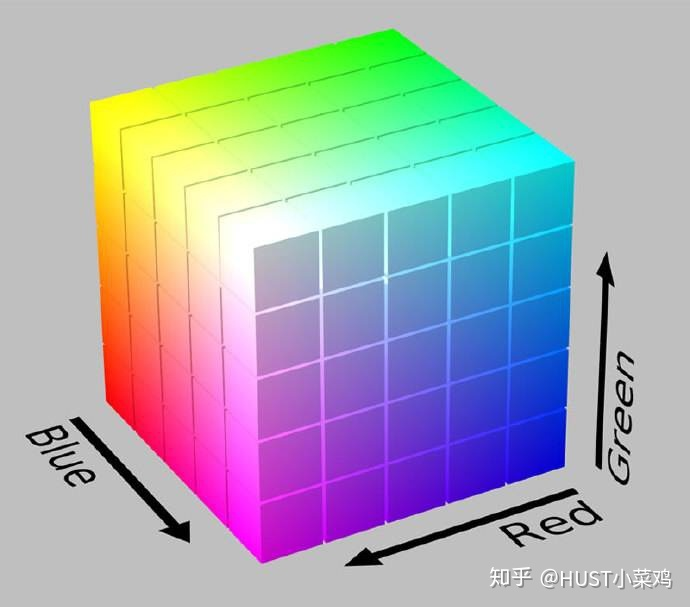

RGB虽然适合于显示系统，却并不适合于图像处理。在计算机视觉中，HSV空间和HSI空间更常用。下面主要介绍HSV空间。

#### HSV

HSV空间通过色相(H)，饱和度(S)，和亮度(V)表示空间内的每一个颜色。

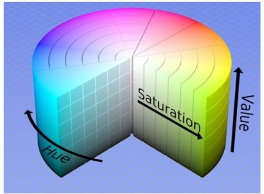

从上图中可以看出，HSV空间相对于RGB空间的一大优势，即HSV空间中每一种颜色所在的区域是连续的。 HSV空间的三个坐标都各有其范围：$H$坐标的范围为$[0,180]$，$S$和$V$得范围都为$[0, 255]$。

常见颜色的HSV表格如下。

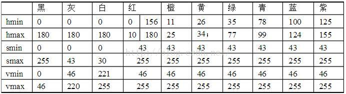

#### OpenCV中的色彩空间

在OpenCV中，提供了几种颜色空间转换的函数`cvtColor`。 其声明为：

```cpp
void cv::cvtColor(InputArray src, OutputArray dst, int code, int dstCn = 0) 
```

其中code为具体的颜色空间转换指令，常用的指令有：
- COLOR_BGR2HSV
  - 从BGR转为HSV
- COLOR_BGR2GRAY
  - 从BGR转为灰度图
- COLOR_BGR2RGB
  - 从BGR转为RGB

**注意**：OpenCV中，图片读入后的默认色彩空间为`BGR空间`，而非RGB空间。

## 基本组件

### Mat

`Mat` 是OpenCV中常用的基本类型，即矩阵类。在OpenCV中常常被用于储存图像数据。

#### Mat的构造方式

- `Mat{}`
  - 构造一个空的矩阵，不包含大小和维度，一般无法直接使用。只用于接受函数输出或从外部读入的数据。
- `Mat(int rows, int cols, int type) `
  - 创建一个行数为rows，列数为cols，数据类型为type的矩阵。其中，常用的type有：
    - CV_8UC3 这是很常用的处理图片的格式，其中8U代表8位无符号整数，C3代表3通道，这是一般用来储存3通道图像的格式。
    - CV_8UC1 这是很常用的处理图片的格式，其中8U代表8位无符号整数，C1代表1通道，这是一般用来储存单通道图像的格式。
    - CV_64FC1 这种格式可以储存一般的实数阵，其中64F代表64位浮点数，C1代表单通道。

#### Mat的访问方式

Mat 无法直接使用`[]`进行随机访问，通常我们需要使用其他方式。

- `Mat::at(int row, int col)`
  - 随机访问 row 行 col 列的元素。
- `Mat::ptr(int i0 = 0)`
  - 返回第 io 行的指针，进而通过指针进一步访问元素。

#### Mat的复制

由于 Mat 实际上是存储了数据的头和指针信息，因此如果直接使用`=`进行复制操作，会导致头和指针一同被复制，两个对象的指针指向的是同一份数据。在后续的操作中会出现连锁反应。

```cpp
#include <opencv2/opencv.hpp>
#include <iostream>

int main() {
    cv::Mat src = cv::Mat::eye(3, 3, CV_8UC1);

    cv::Mat a = src;
    cv::Mat b = src.clone();
    cv::Mat c;
    src.copyTo(c);

    src.at<uint8_t>(1, 2) = static_cast<uint8_t>(2);
    std::cout << src << std::endl;
    std::cout << a << std::endl;
    std::cout << b << std::endl;
    std::cout << c << std::endl;
    return 0;
}
```

因此，如果我们需要安全地复制Mat对象，我们需要使用Mat类中的`Mat::clone()`或`Mat::copyTo(Mat dst)` 方法。

#### Mat的基本运算

```cpp
#include <opencv2/opencv.hpp>
#include <iostream>

int main() {
    cv::Mat a = cv::Mat::eye(3, 3, CV_64FC1);
    cv::Mat b = (cv::Mat_<double>(3, 3) << 1, 2, 3, 4, 5, 6, 7, 8, 9);
    std::cout << "a:" << std::endl << a << std::endl << "b:" << std::endl << b << std::endl;

    std::cout << "a+b:" << std::endl << a + b << std::endl;
    cv::Mat tmp = cv::Mat(3, 3, CV_64FC1);
    cv::add(a, b, tmp);
    std::cout << "add(a, b):" << std::endl << tmp << std::endl;

    std::cout << "a-b:" << std::endl << a - b << std::endl;
    cv::subtract(a, b, tmp);
    std::cout << "subtract(a, b):" << std::endl << tmp << std::endl;

    std::cout << "a*b:" << std::endl << a * b << std::endl;
    cv::multiply(a, b, tmp);
    std::cout << "multiply(a, b):" << std::endl << tmp << std::endl;

    return 0;
}
```

对于矩阵的加法、减法、乘法，OpenCV都重载了相关的运算符，可以直接用于计算。

同时，OpenCV也提供了相应的函数。
```cpp
cv::add(const MatExpr &expr1, const MatExpr &expr2, MatExpr &res)
cv::subtract(const MatExpr &expr1, const MatExpr &expr2, MatExpr &res)
```

值得注意的是，乘法所对应的函数：
```cpp
cv::multiply(const MatExpr &expr1, const MatExpr &expr2, MatExpr &res)
```

实现的是对应位数据相乘，而非矩阵乘法。

### 图片

#### 读取图片

```cpp
cv::Mat src;
src = cv::imread("/home/wpie/Documents/demo.jpg")；
```

#### 写入图片

相应地，OpenCV提供了写入图片的函数，在此不过多赘述，如有需要请自行了解。
```cpp
cv::imwrite(const String &location, const cv::Mat &src)
```

### 视频

#### 读取视频

```cpp
  #include <opencv2/core/core.hpp>
  #include <opencv2/highgui/highgui.hpp>
  #include <iostream>
  int main()
  {
      cv::VideoCapture capture("/home/wpie/Downloads/demo.mp4");
      cv::Mat src;
      while (capture.read(src))
      {
          cv::imshow("src", src);
          cv::waitKey(50);
      }
      return 0;
  }
```

OpenCV中提供了VideoCapture类来完成视频的读取工作。要从一个视频对象中获取每一帧的图像，可以使用`VideoCapture::read(Mat dst)`函数或者重载的`>>`来完成。

```cpp
Mat src{};
cv::VideoCapture capture("/home/wpie/Downloads/demo.mp4");

while(capture.read(src)){
    // ......
}
```

```cpp
Mat src{};
cv::VideoCapture capture("/home/wpie/Downloads/demo.mp4");

while(true){
    capture >> src;
    if(src.empty()) 
        break;

    // ......
}
```

#### 写入视频

OpenCV中提供了VideoWriter类来完成视频的写入工作。

```cpp
 VideoWriter (const String &filename, int fourcc, double fps, Size frameSize, bool isColor=true)
```
其中各个参数含义为：
- filename:  文件的路径
- fourcc:    输出视频的格式
- fps:       输出视频的帧率
- frameSize: 输出视频中的图片大小
- isColor:   是否是彩色的

要向一个视频对象中写入每一帧的图像，可以使用`VideoCapture::write(Mat src)`函数或者重载的`<<`来完成。若有需要请自行了解。

## 基于轮廓的传统视觉的一般流程

基于轮廓的传统视觉的优点是原理简单，实现较快，而且很多情况下能表现出不错的效果。

当然，他也有缺点，他的缺点是对环境条件和参数，过亮或者过暗的环境以及参数的改变都会影响这种识别的效果。

顾名思义，基于轮廓的传统视觉的核心就是提取候选的轮廓，并通过各种方式筛选出属于最终目标的轮廓。

### 提取颜色

我们读入的图片，往往是彩色的RGB三通道图片，而我们的视觉识别目标通常是其中单一颜色的对象。因此在进行后续处理之前，我们需要先对提取出目标颜色的部分。

#### 通道相减法

对于色彩空间为RGB的图片，我们最容易想到的方法就是通道相减法。

在RM比赛中，双方的装甲板分别是红、蓝两种颜色。因此当我们希望提取画面中红色的部分时，只需要通过红色通道减去蓝色通道就可以获得极佳的效果。而当我们希望提取画面中蓝色的部分时，只需要使用蓝色通道减去红色通道。

```cpp
Mat channels[3]{};

split(input, channels);                             // 三通道分离

Mat blue_channel = channels[0] - channels[2];       // 蓝-红，提取蓝色部分
```

#### HSV颜色提取

前文中已经介绍了HSV颜色空间的概念，他有一个重要的性质，即同一种颜色在HSV颜色空间是连续的。因此，如果我们想要提取图像中的某一种颜色，那么只需要找到所求颜色在HSV空间中出现的坐标范围，并把图像中处在这个区间内的像素点的值全部保留，其余值置为$0$即可完成颜色提取。

OpenCV提供了可以实现HSV颜色提取的函数：

```cpp
void cv::inRange(InputArray src, InputArray lowerb, InputArray upperb, OutputArray dst )
```
其中`lowerb`和`upperb`分别对应HSV空间中坐标范围的下界和上界。我们可以参照上文中给出的表。

```cpp
Mat hsv{};
cv::cvtColor(input, hsv, cv::COLOR_BGR2HSV);   // 将颜色空间从BGR转为HSV

Mat blue{};
cv::inRange(hsv, cv::Scalar(100, 43, 46), cv::Scalar(124, 255, 255), hsv_part1);                // 提取蓝色
```

当然，HSV颜色提取虽然是一种非常优秀的二值化方法，但他也存在自己的局限性。例如亮度的变化会对HSV数值造成干扰。同时，在实际使用过程中，如果相机的感光元件敏感度较高，也会造成图像中出现噪点，形成椒盐噪声。此外，在感光角度不同时，相机获取到的颜色饱和度和色相也会发生一定程度的变化，造成HSV空洞。

### 二值化

通过颜色提取，我们已经获取了图像中特定颜色的部分。图像从三通道图坍缩为单通道图，在该单通道图中，带有特定颜色的区域具有值，而其它区域值均为0.

在这一步中，我们需要进行二值化操作，以使输出的图像矩阵中只有0与255两个数值，以方便后续的处理。

#### 设定阈值法

通过设定一个阈值以实现二值化是最简单的二值化方法。 对于一张图片，他的每一个像素都处在区间$[0, 255]$之中。我们只需要设定一个中间值$threshold$，使所有灰度大于$threshold$的像素点转换为白色，所有灰度小于$threshold$的像素点转换为黑色。这样一个最简单的二值化就完成了。

在OpenCV中，我们使用
```cpp
double cv::threshold(InputArray src, OutputArray dst, double thresh, double maxval, int type)
```
来完成该操作。

其中各参数含义为：
- src:   输入
- dst:   输出
- thres: 设定的二值化阈值
- maxval:使用 THRESH_BINARY 或 THRESH_BINARY_INV 进行二值化时使用的最大值
- type:  二值化算法类型

其中二值化算法类型主要有以下几种：
- THRESH_BINARY:
  - 将小于 thres 的值变为 0 ，大于 thres 的值变为 255
- THRESH_BINARY_INV:
  - 将小于 thres 的值变为 255, 大于 thres 的值变为 0
- THRESH_TRUNC:
  - 将大于 thres 的值截取为 thres, 小于 thres 的值不变
- THRESH_TOZERO:
  - 将小于 thres 的值变为 0 , 大于 thres 的值不变
- THRESH_TOZERO_INV:
  - 将大于 thres 的值变为 0 , 小于 thres 的值不变

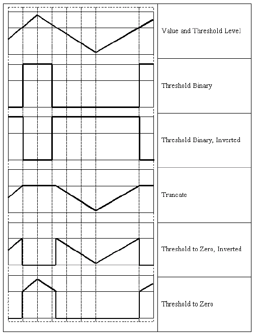

其中，我们一般使用的是 `THRESH_BINARY` 。

```cpp
Mat threshold_result{};

threshold(blue_channel, threshold_result, 100, 255, THRESH_BINARY);

```

#### 自适应二值化

在许多情况下，直接设定阈值的方法就可以得到比较好的效果，但在实际应用中，由于光环境的变化，一个固定的阈值往往难以满足变化的环境，这时候我们就需要一个算法自动求出一张图片中合适的阈值。

在OpenCV中，内置了最常用的`大津二值化方法`。

`threshold`函数的`type`参数，除了上述介绍的几种方法外，还有一种方法叫`THRESH_OTSU`，这就是`大津二值化方法`。

当`type = cv::THRESH_OTSU`时，`threshold`函数参数中的`thresh`值无效，具体数值由`大津法`自行计算，并通过函数返回值返回。

但是通过这种方法设定的阈值，仍然是单一阈值。设定单一阈值有一个明显的缺点，即对于一张图中有明显的光线亮度渐变的图像，单一阈值往往难以起到好的效果。

对于这个问题，OpenCV提供了`adaptiveThreshold`函数用于对不同的区域实现自适应阈值。具体信息我们不在此过多赘述，如有需要请自行了解。

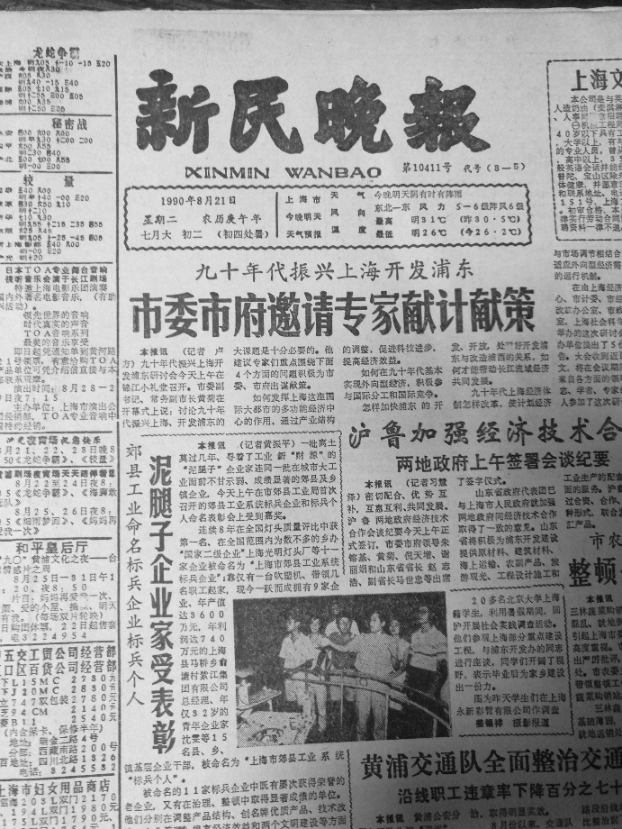
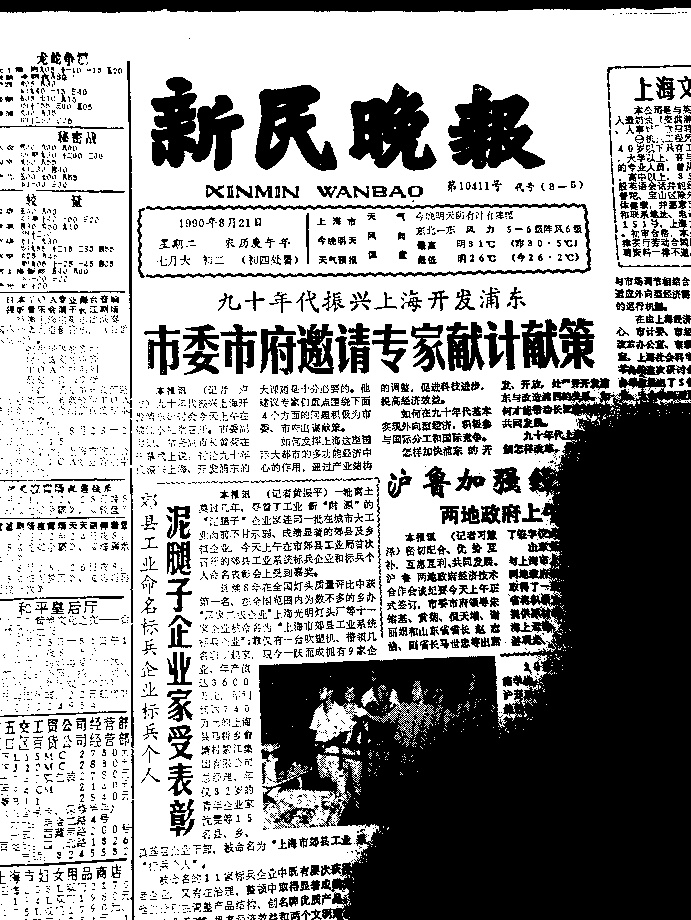
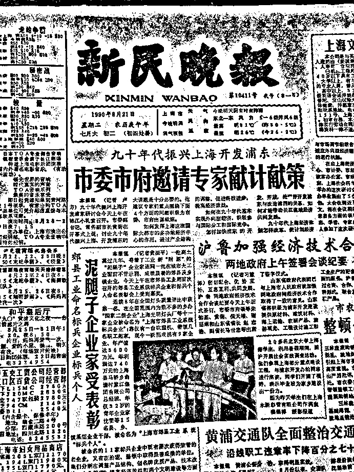

### 图像滤波与形态学运算

在对现实中的图像进行二值化时，二值化的结果往往难以达到最佳状态。许多情况下，二值化会产生空洞或形成噪点。在这种情况下就需要滤波和形态学运算这两大工具来提升二值化结果的质量。

#### 图像滤波

##### 均值滤波

均值滤波是最简单的滤波，也被成为线性平滑滤波。他通过和图像卷积均值滤波算子进行滤波。

在OpenCV中，提供了均值滤波的函数。

```cpp
void cv::blur(InputArray src, OutputArray dst, Size ksize, Point anchor = Point(-1,-1), int borderType = BORDER_DEFAULT)
```

其中ksize即为卷积的矩阵的大小。

以下为均值滤波效果演示：

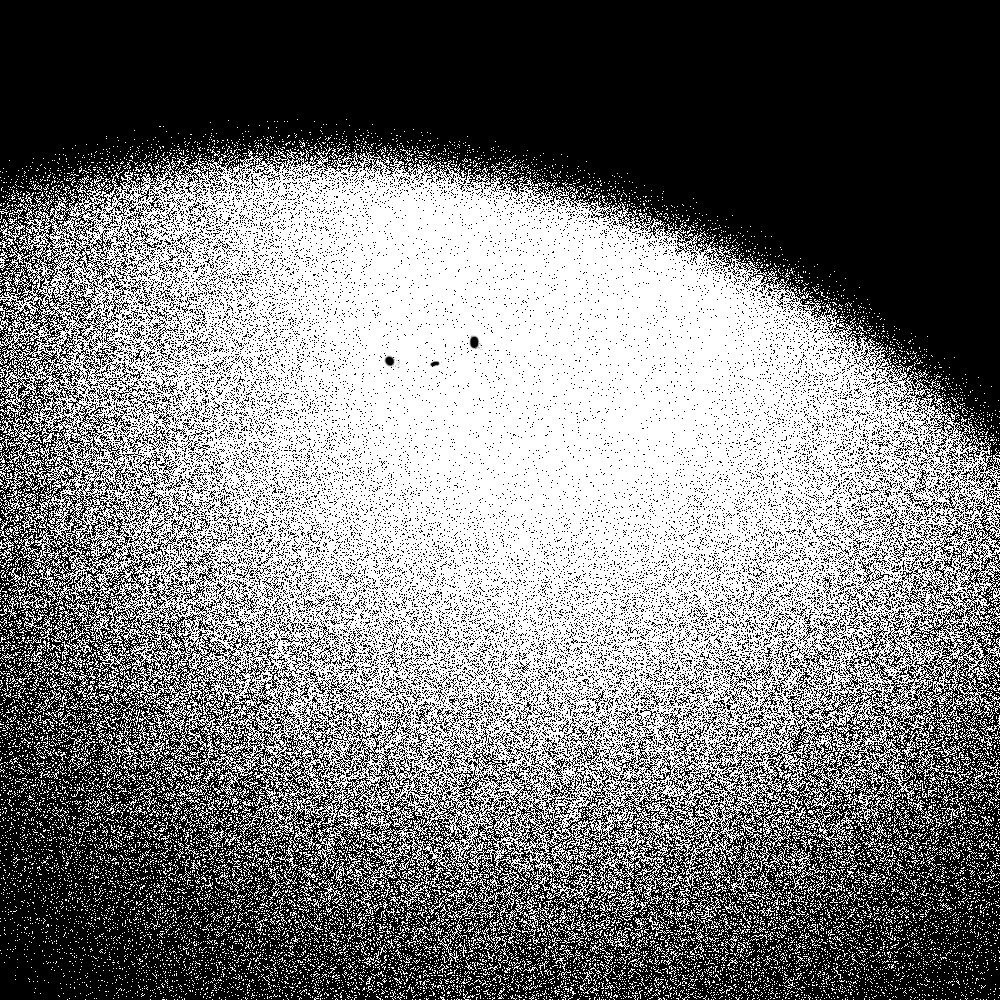


可以看到均值滤波的结果只是使得图片更加模糊，噪声并没有得到很好的消除。 
均值滤波是最快速的滤波算法之一，但同时它的效果却也不够理想，一般无法有效地去除椒盐噪声。

##### 高斯滤波

高斯滤波通过对图像卷积高斯滤波算子实现滤波的效果。

在OpenCV中，提供了高斯滤波的函数。

```cpp
void cv::GaussianBlur(InputArray src, OutputArray dst, Size ksize, double sigmaX = 0, double sigmaY = 0, int borderType = BORDER_DEFAULT)
```

- 其中ksize为高斯算子的大小，sigmaX和sigmaY为高斯函数在$x,y$方向上的偏置。

```cpp
Mat blur_result{};

GaussianBlur(threshold_result, blur_result, cv::Size(7, 7), 0, 0);
```

以下为高斯滤波效果演示：

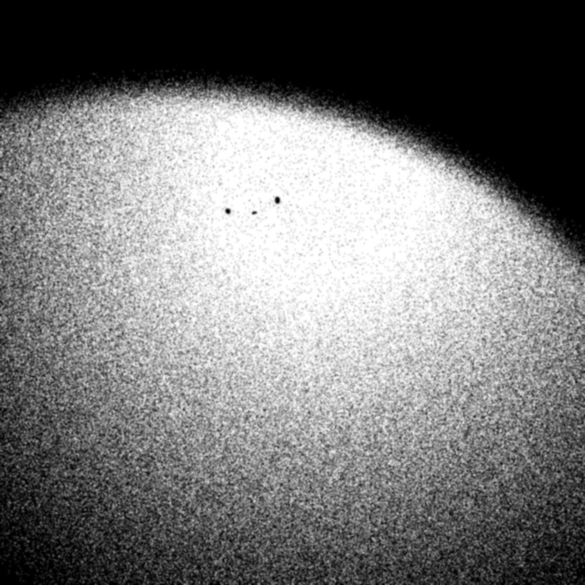

可以看到图中的噪声仍然很大，但图像在平滑效果和特征保留上相对均值滤波都有一定的提升。

##### 中值滤波

中值滤波与前两者最大的不同在于，均值滤波和高斯滤波均为线性滤波，而中值滤波为非线性滤波。

非线性滤波相对于线型滤波，往往都有更好的滤波效果，但代价是会有远高于线型滤波的时间开销。

他通过对方阵内的数进行排序并取中值来进行滤波，往往在去除噪声时有良好的效果。

在OpenCV中，提供了高斯滤波的函数。

```cpp
void cv::medianBlur( InputArray src, OutputArray dst, int ksize );
```

其中ksize即为卷积的矩阵的大小。

以下为中值滤波效果演示：

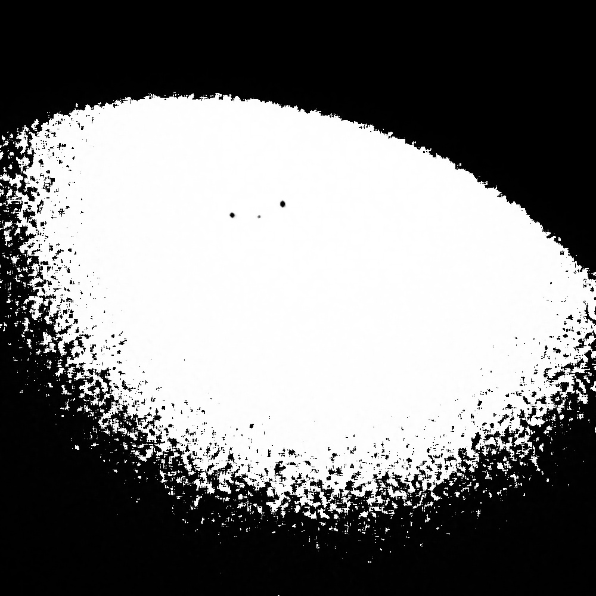

可以看到中值滤波在去除椒盐噪声上有着良好的表现，但在信息的保存上劣于高斯滤波。

#### 形态学运算

##### 膨胀腐蚀

膨胀是图像中的高亮部分进行膨胀，类似于领域扩张。可以用于填补孔洞或连接断点。

腐蚀是原图的高亮部分被腐蚀，类似于领域被蚕食。可以用于消除杂点。

在OpenCV中，他们相应的函数分别为：

```cpp
void cv::dilate( InputArray src, OutputArray dst, InputArray kernel);

void cv::erode( InputArray src, OutputArray dst, InputArray kernel);
```

其中kernel即为相应操作的卷积核。

在OpenCV中，我们一般使用以下函数来获得卷积核：

```cpp
getStructuringElement(MORPH_RECT, Size ksize);
```

其中ksize即为卷积核大小。

##### 开运算闭运算

由于单独使用腐蚀或膨胀处理，会对原有图形的大小和形状造成影响，不利于后续处理。

因此我们通常在腐蚀或膨胀处理后，再进行一次相同卷积核的相反处理，以消除对原有图形的影响。

开运算：腐蚀 -> 膨胀，通常用于去除杂点。

闭运算：膨胀 -> 腐蚀，通常用于填补孔洞。

在OpenCV中，他们相应的函数为：
```cpp
void cv::morphologyEx( InputArray src, OutputArray dst, int op, InputArray kernel);
```

其中主要参数的含义为：
- op
  - 形态学操作类型
    - 其中主要使用的有：
      - MORPH_OPEN
        - 开运算
      - MORPH_CLOSE
        - 闭运算
- kernel
  - 相应操作的卷积核
    - 参考上面使用`getStructuringElement()`函数获得

```cpp
Mat open_result{};

Mat element = getStructuringElement(MORPH_RECT, Size(3, 3));
morphologyEx(blur_result, open_result, MORPH_OPEN, element);
```

### 轮廓提取

在完成图像的二值化后，我们可以开始处理我们真正感兴趣的东西——轮廓。 边缘检测算法是常用于画出图像中轮廓的方法，他们的基本原理大体上都是感知图像中像素层面上的梯度。 

在OpenCV中，提供了函数如下来完成轮廓提取操作。
```cpp
void cv::findContours(InputArray image, OutputArrayOfArrays contours, OutputArray hierarchy, int mode, int method)
```

其中image为需要进行轮廓提取的图像，contours为提取到的轮廓序列，hierarchy中记录了轮廓间的拓扑结构，mode指示提取出的轮廓的储存方法，method指示使用的轮廓提取方法。

其中mode常用的有以下几种：
- RETR_EXTERNAL:
  - 只列举外轮廓
- RETR_LIST:
  - 用列表的方式列举所有轮廓
- RETR_TREE:
  - 用树状的结构表示所有的轮廓，在这种模式下会在hierachy中记录轮廓的父子关系

其中method常用的有以下几种：
- CHAIN_APPROX_NONE:
  - 绝对的记录轮廓上的所有点
- CHAIN_APPROX_SIMPLE:
  - 记录轮廓在上下左右四个方向上的末端点（轮廓中的关键节点）

其中contours是提取到的轮廓的集合。而每一个轮廓实际上是一系列点的集合。

对于每一个轮廓，hierarchy 都包含 4 个整型数据，分别表示：后一个轮廓的序号、前一个轮廓的序号、子轮廓的序号、父轮廓的序号。


```cpp
std::vector<std::vector<cv::Point>> contours;
std::vector<cv::Vec4i> hierachy;
findContours(open_result, contours, hierachy, cv::RETR_TREE,cv::CHAIN_APPROX_NONE);
```

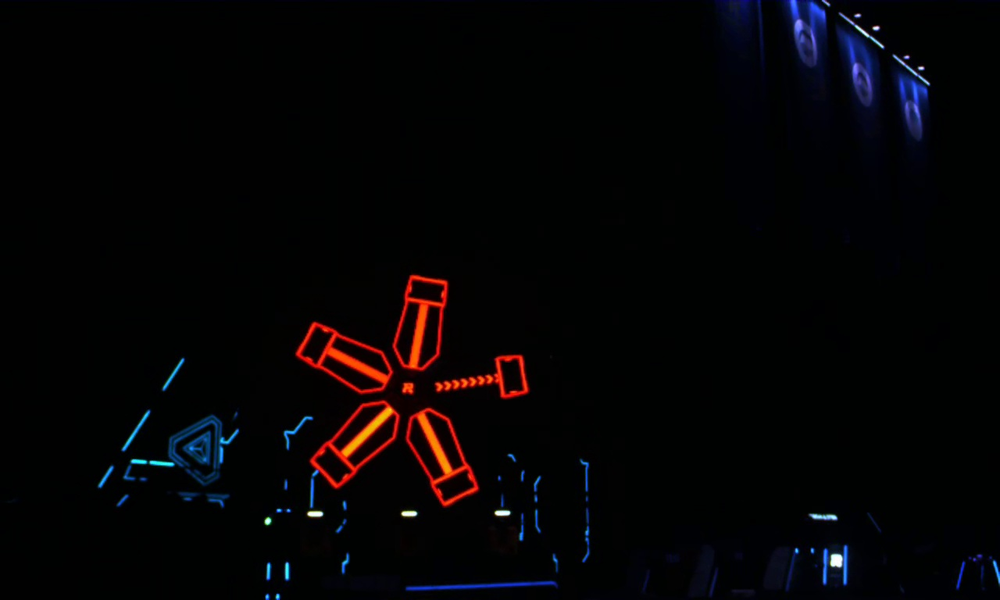
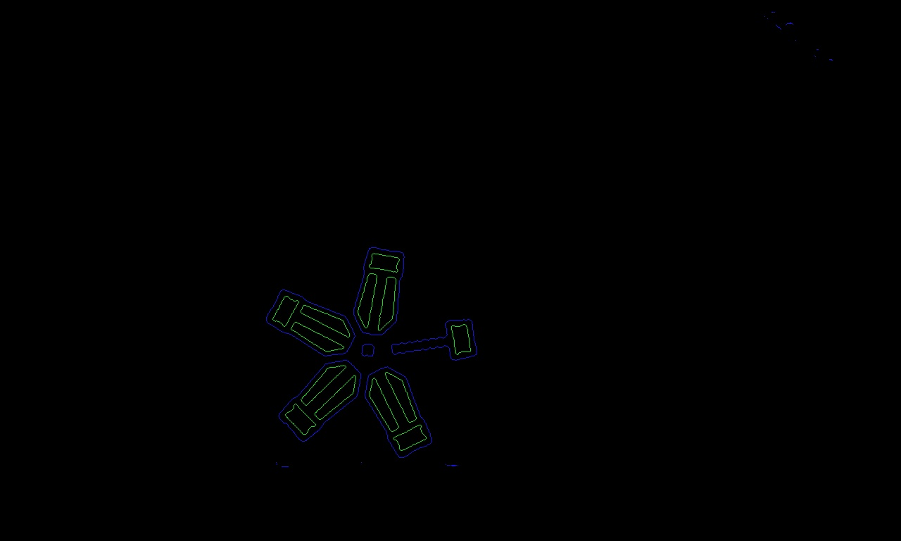

### 轮廓筛选

通过findContours完成轮廓提取后，我们面对的问题便是如何对提取出的轮廓进行筛选，在大量的轮廓中找出我们感兴趣的轮廓。

轮廓筛选最基本的思想就是用轮廓自身的几何性质以及轮廓间的几何关系，实现对目标轮廓的约束，排除不感兴趣的轮廓。

在这一步骤中，我们有几个常用的函数：

- double cv::contourArea(InputArray contour, bool oriented = false)
  - 这个函数可以用来求出一个轮廓的大小
  - 第一个参数为输入的轮廓
  - 另外，若第二个参数为true，则函数会返回一个带有符号的浮点数，符号基于轮廓的方向
  - 如果第二个参数为false，则函数会返回轮廓面积的绝对值。
- double cv::arcLength(InputArray curve, bool closed)
  - 这个函数可以用来求出一个轮廓的周长
  - 第一个参数为输入的轮廓
  - 第二个参数为轮廓是否是封闭的
  - 返回轮廓的周长
- Rect cv::boundingRect(InputArray array)
  - 这个函数输入一个轮廓，返回最小的包含轮廓的正向外接矩形（不带有旋转）
- RotatedRect cv::minAreaRect(InputArray points)
  - 这个函数输入一个轮廓，返回轮廓的最小外接矩形（带有旋转）
- void cv::convexHull(InputArray points, OutputArray hull, bool clockwise=false, bool returnPoints=true)
  - 此函数被用来求解轮廓的凸包
  - 第一个参数为输入的轮廓，第二个参数为输出的凸包
  - 第三个参数如果为true，则返回顺时针的轮廓，如果为false，则返回逆时针。
  - 第四个参数如果为true，则用点表示凸包，如果为false，则用点的索引表示凸包，在hull的类型为vector的情况下，第四个参数失效，依靠vector的类型决定。

下面列举几个常用轮廓筛选的手段：

#### 面积/周长大小约束

面积/周长大小约束是最简单的约束之一，即通过轮廓所包含区域的大小或是轮廓的周长大小筛选指定的轮廓。 这种方法虽然简单粗暴，但对于一些环境干扰小的简单环境往往能够取得相当不错的效果。 

```cpp
bool judgeContourByArea(const std::vector<cv::Point> &contour)
{
    
    if (cv::contourArea(contour) > 2000) // 舍弃小轮廓
        return true;
    return false;
}
```

这种方法简单高效，但也尤其缺点，确定是鲁棒性低，容易受干扰，对于每一个场景往往需要针对输入调参后才能使用。

#### 与矩形相似性约束

在轮廓筛选时常常会需要筛选一些较规则的形状，如矩形轮廓等。在这种情况下，一般来说我们可以通过将轮廓的最小外接矩形与轮廓本身进行比较来实现筛选。

常见的筛选方法是通过面积和周长比较来实现。此外，由于矩形的特殊性，也可以通过矩形的长宽比进行筛选。

```cpp
int index = 0;
for (const auto &contour: contours) {
    auto min_rect = minAreaRect(contour);
    auto rect_area = min_rect.size.area();
    auto contour_area = contourArea(contour);

    if (abs((rect_area / contour_area) - 1) < 0.05) {
        drawContours(contour_result, contours, index, Scalar{0, 0, 255}, 5);
        circle(contour_result, min_rect.center, 15, Scalar{0, 0, 255}, -1);
    }
    index++;
}
```

#### 轮廓凹凸性约束

这种方法能通过轮廓的凹凸性对凹轮廓或凸轮廓进行有针对性的筛选。 一般来说可以通过将轮廓的凸包与轮廓本身进行比较来实现。

常用的比较方法有：

- 面积比例比较
  - 对于凸轮廓，轮廓的凸包面积与轮廓本身的面积比应该接近$1:1$，而一般的凹轮廓的比值应该明显大于$1$。
- 周长比值比较
  - 一般来说，对于凸轮廓，轮廓的凸包周长和轮廓本身的周长相近，而凹轮廓的轮廓本身周长应当明显大于凸包周长

#### 拓扑关系约束

在一张复杂的图片中，轮廓中往往有各种复杂的拓扑关系。 例如一个轮廓，他的拓扑关系可能有以下几种主要性质：
- 是否是最外层轮廓
- 是否是最内层轮廓
- 是否有子轮廓
- 子轮廓的个数是多少
- 他是谁的子轮廓
- ……

在拓扑关系约束中，主要利用的就是`findContours()`函数的`hierarchy`输出。

#### 通过与其他轮廓的几何关系判断

这种方法整体上灵活多变，要根据具体情况选择具体方法，整体的思想是通过与另一个已知轮廓（也可能未知）的几何关系进行筛选。