# 机器学习与ROS初步

## 神经网络

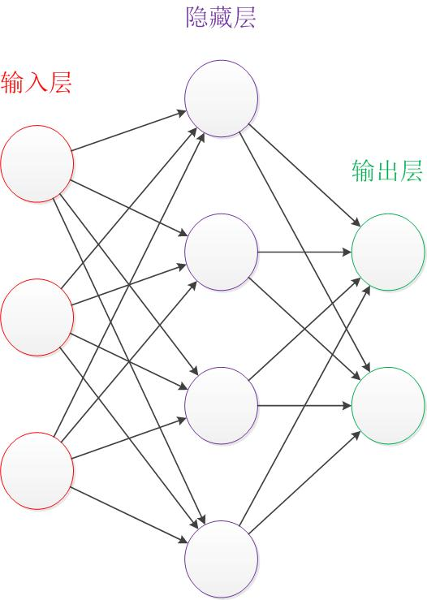

事实上，神经网络的本质就是通过权重与激活函数来拟合特征与目标之间的真实函数关系。

一个神经网络的训练算法就是让权重的值调整到最佳，以使得整个网络的预测效果最好。

### 神经元

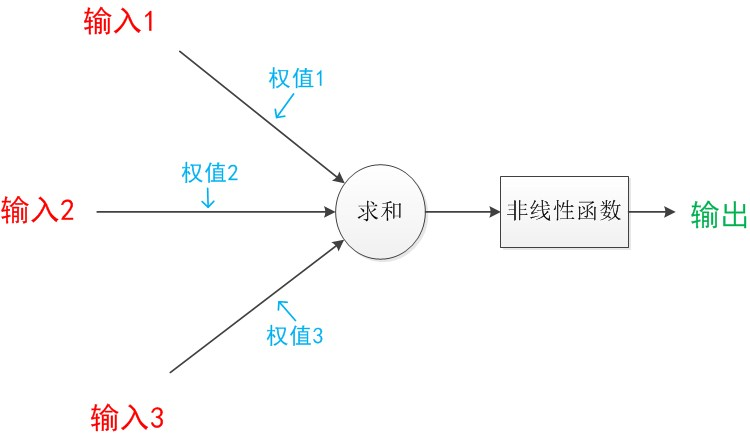

在神经元模型里，每个有向箭头表示的是值的加权传递。

其中的“非线性函数”也被称为“激活函数”。

如果我们将神经元图中的所有变量用符号表示，并且写出输出的计算公式的话，就是下图

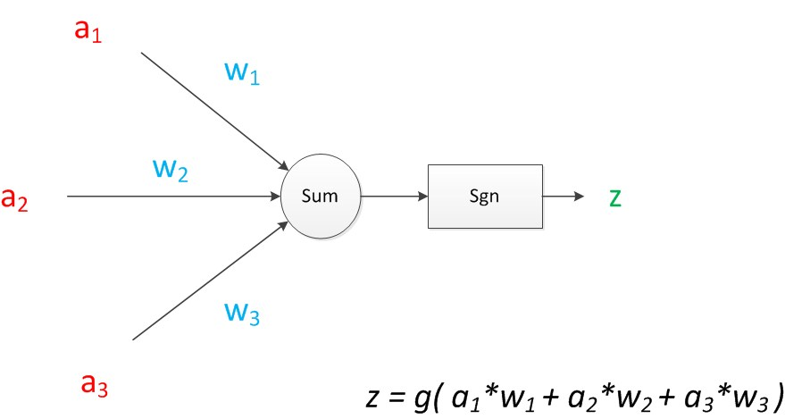

神经元可以看作一个计算与存储单元。计算是神经元对其的输入进行计算功能。存储是神经元会暂存计算结果，并传递到下一层。

### 感知机模型

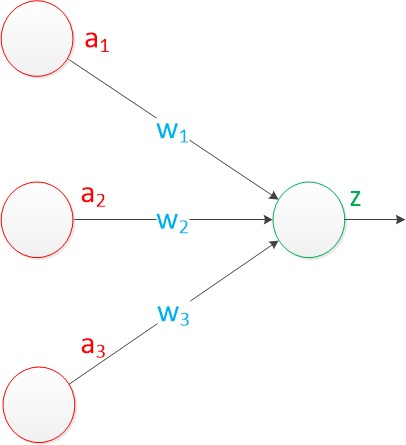

在“感知器”中，有两个层次。分别是输入层和输出层。输入层里的“输入单元”只负责传输数据，不做计算。输出层里的“输出单元”则需要对前面一层的输入进行计算。

#### 单层与多层感知机

单层感知机即只有一层计算层，如下图：

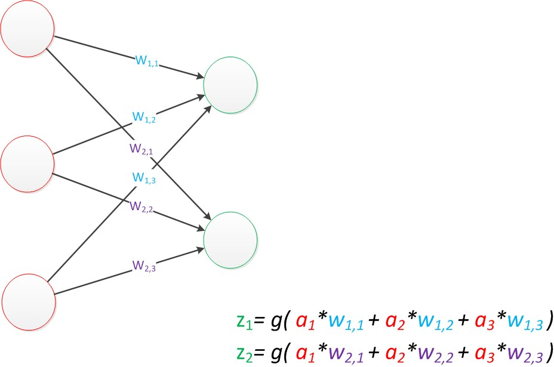

单层感知机能够实现对目标的线性分类。

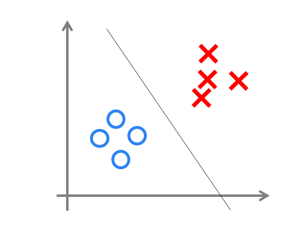

也就是当数据的维度是n维时，就是划出一个n-1维的超平面。

而这并不能够满足我们的使用，现实中有大量无法使用线性函数进行分类的场景。因此我们需要引入更多的计算层，这些引入的计算层也被成为隐藏层：

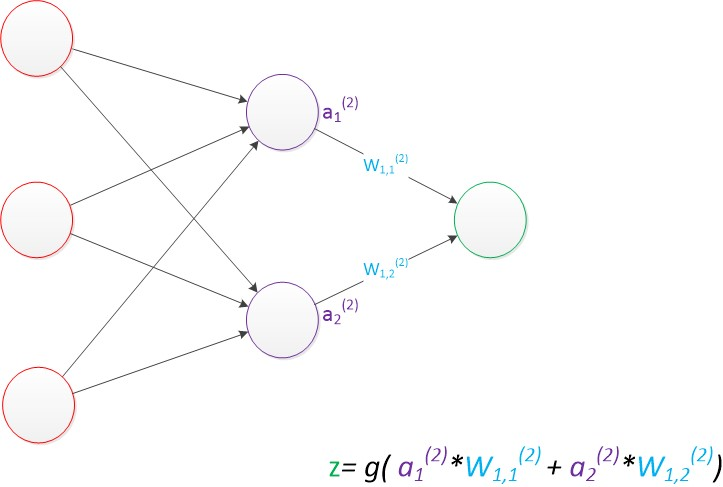

与单层神经网络不同。理论证明，多层神经网络可以无限逼近任意连续函数。

下图为两层神经网络的分类决策平面：

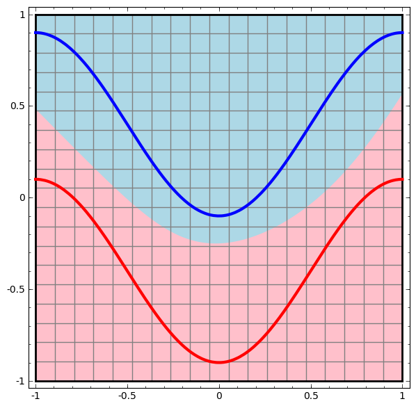

我们可以注意到，多层感知机模型的输出层仍然为线性分类层，应当只能做线性分类任务。那么为什么多层感知机的输出却可以为非线性函数呢？问题就出在隐藏层上。数据从输入层到隐藏层，发生了空间变换。

也就是说，在多层神经网络中，隐藏层对原始的数据进行了一个空间变换，使其可以被线性分类，然后输出层的决策分界划出了一个线性分类分界线，对其进行分类。

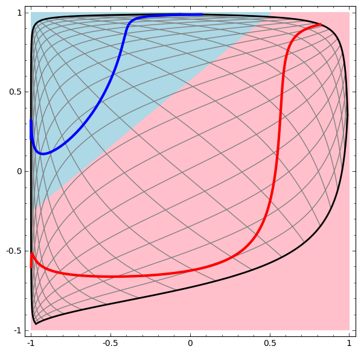

### 激活函数

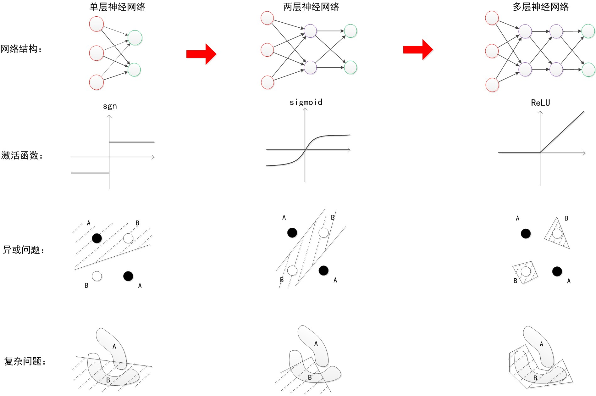

### 网络训练

机器学习模型训练的目的，就是使得参数尽可能的与真实的模型逼近。

#### 损失与损失函数

样本的预测目标为$y_p$，真实目标为$y$。那么，定义一个值$loss$，计算公式如下。

$loss = (y_p - y)^2$

这个值称之为损失（loss），我们的目标就是使对所有训练数据的损失和尽可能的小。

我们可以把神经网络的预测公式带入到$y_p$中，得到损失$loss$关于神经网络各个参数的函数，这个函数称之为**损失函数**。

那么我们的问题就变成了：如何优化参数，能够让损失函数的值最小？

#### 梯度下降

此时这个问题就被转化为一个优化问题。一个常用方法就是高等数学中的**求导**，但是这里的问题由于参数不止一个，求导后计算导数等于0的运算量很大，所以一般来说解决这个优化问题使用的是**梯度下降算法**。梯度下降算法每次计算参数在当前的梯度，然后让参数向着梯度的反方向前进一段距离，不断重复，直到梯度接近零时截止。一般这个时候，所有的参数恰好达到使损失函数达到一个最低值的状态。

#### 反向传播

在神经网络模型中，由于结构复杂，每次计算梯度的代价很大。因此还需要使用**反向传播算法**。反向传播算法是利用了神经网络的结构进行的计算。不一次计算所有参数的梯度，而是从后往前。首先计算输出层的梯度，然后是第二个参数矩阵的梯度，接着是中间层的梯度，再然后是第一个参数矩阵的梯度，最后是输入层的梯度。计算结束以后，所要的两个参数矩阵的梯度就都有了。

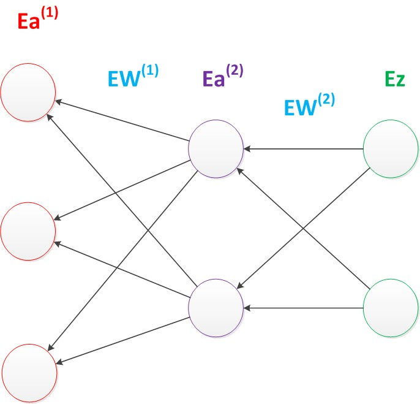

#### 过拟合与泛化与正则化

优化问题只是训练中的一个部分。机器学习问题之所以称为学习问题，而不是优化问题，就是因为它不仅要求数据在训练集上求得一个较小的误差，在测试集上也要表现好。因为模型最终是要部署到没有见过训练数据的真实场景。提升模型在测试集上的预测效果的主题叫做**泛化**，相关方法被称作**正则化**。神经网络中常用的泛化技术有**权重衰减**等。

## 机器学习

### 简单流程

- 标定
- 训练
- 测试
- 部署

### 卷积

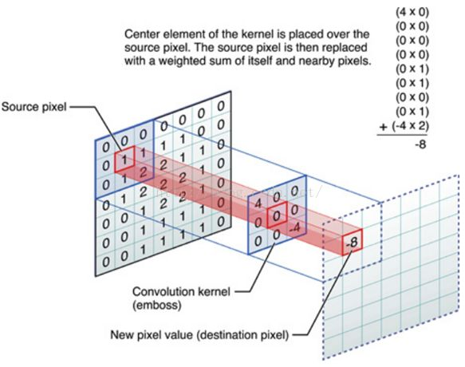

卷积核上所有作用点依次作用于原始像素点后（即乘起来），线性叠加的输出结果，即是最终卷积的输出。

### 目标检测

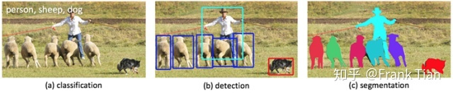

目标分类 -> 目标检测 -> 实例分割

### Yolo

**Torch** 是一个有大量机器学习算法支持的科学计算框架，是一个与 Numpy 类似的张量 Tensor 操作库。

**PyTorch** 是一个基于 Torch 的 Python 开源机器学习库，用于自然语言处理等应用程序。

**Yolo** 是目标检测模型算法，论文最早于CVPR上被提出，后经过多次更新迭代。

应用最广泛的 **Yolo** 模型实现通常是基于 **PyTorch** 开发的。

目前 **Yolo** 系列最新版本为 **YoloV8** *(4d前，真快啊)*。其中在RM视觉应用最为广泛的是 **YoloV5** 。

#### Why Yolo

**YOLO** 的全称是 `you only look once` ，指只需要浏览一次就可以识别出图中的物体的类别和位置。

在 **Yolo** 之前的目标检测模型，工作流程通常需要分为两步：

- 先通过计算机图形学（或者深度学习）的方法，对图片进行分析，找出若干个可能存在物体的区域。
- 将这些区域裁剪下来，放入一个图片分类器中，由分类器分类。

这样的模型也被称为 **两阶段（2-stage）模型**，使用的方法被成为 **Region-based 方法**。

而 **Yolo** 只需要进行一次扫描即可完成目标检测，被称为 **单阶段（1-stage）模型** ，使用的方法称为 **Region-free 方法**。

因此 **Yolo** 相比于它的前辈们拥有更快的分类速度，同时 **Yolo** 也吸收了许多先进的算法，来进一步提升检测的准确性。

#### YoloV1

##### 预测阶段

##### 后处理阶段

##### 训练阶段

## ROS

### why ROS

起初我们想设计一个非常复杂nb的机器人。虽然这项工作上整体比较复杂，但是其中应当有许多小的子功能是在其它地方已经开发好的，我们可以直接拿来使用，并且我们也希望通过这种共享方式来提高开发效率。

但是目前很多资源要么难以共享，要么共享的资源之间不能直接拿过来用，还需要经过大幅的修改。

因此我们急需这样一个能够整合资源的框架和接口，使得资源之间能够共享使用，以此来提高各种功能、软件的复用率。

因此，ROS(Robotics Operating System,机器人操作系统)诞生了。虽然表面上叫做操作系统，但是并不是真正的操作系统，说白了，就是一个框架，一个平台。

它能够实现程序功能模块的解耦与复用。

- 步兵
  - 电控
    - 底盘
      - 舵轮控制
      - 底盘解算
      - 小陀螺
    - 云台
      - 云台控制
      - 云台解算
      - IMU
    - 射击
      - 摩擦轮控制
      - 拨盘控制
      - 射击逻辑
    - 裁判系统
      - 数据处理
      - UI显示
      - 裁判系统交互
    - 远程控制
      - 遥控器控制
      - 键盘控制
  - 视觉
    - 相机
      - 相机API
      - 图像采集
    - 图像处理
      - 识别
        - 预处理
        - 装甲板识别
        - 大符识别
      - 解算
        - PnP解算
        - 坐标系转换
        - 轨迹匹配
      - 预测
        - 卡尔曼滤波
        - 反小陀螺
        - 运动模型
      - 通信
      - 网页调参

### 整体框架

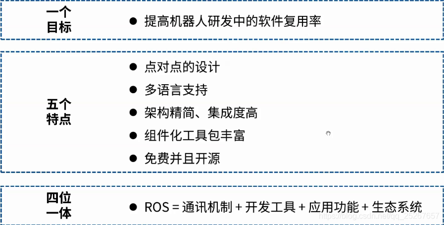

### 系统层次

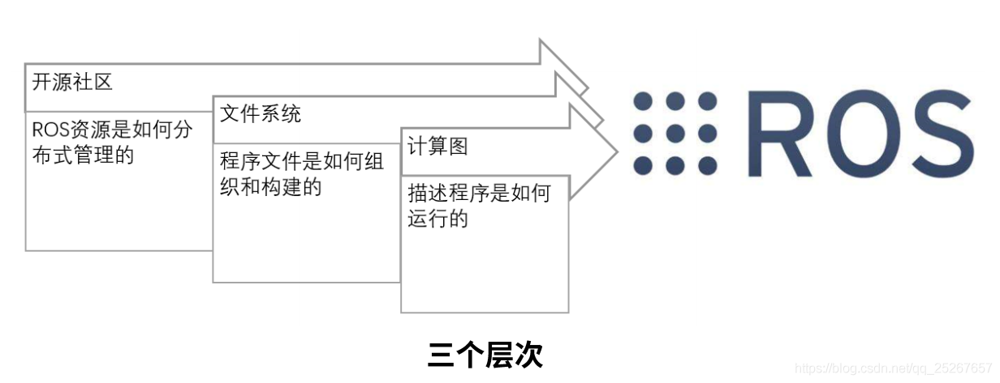

#### 计算图层

##### 节点

由整体拆分细化得到的**功能**，在ROS中成为**节点**，是ROS最为重要、基本的概念。一个功能由一个节点提供，这些节点组合起来成为完整的软件。

可以类比于操作系统中**线程**与**进程**的关系。

##### 节点管理器

管理多个子节点的控制中心。

##### 话题

在ROS中，节点之间相互独立，那么节点之间的数据交换就需要借助ROS提供的通讯机制。主要分为：**话题**与**服务**。

我们首先介绍**话题**，ROS中的**话题**采用了**发布/订阅**模型，可以用于多对多节点的通信，但是只能是从发布者到订阅者的**单向异步通信**。

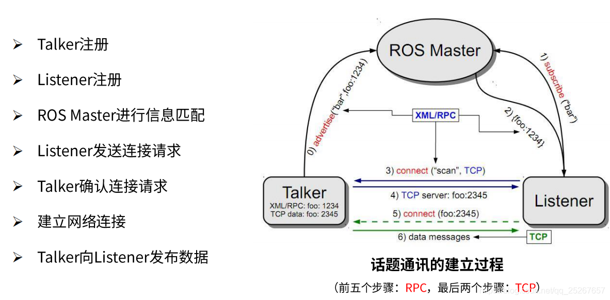

##### 服务

ROS中的**服务**采用了**客户端/服务器**模型，可以用于一对多节点的**双向同步通信**。

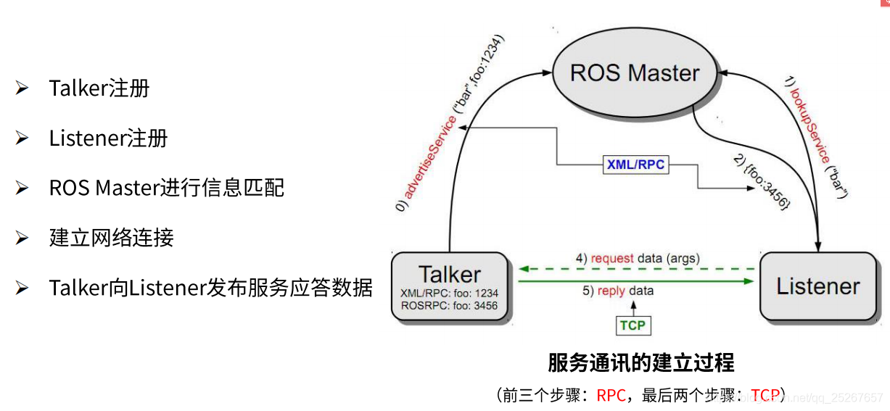

#### 文件系统层

ROS 的文件的组织和排列是按照功能来进行的，不同功能的文件被放置在不同的文件夹下面，**功能包（package）** 是 ROS 的文件系统层次下一个比较基本的单元，ROS 的文件系统层次也是围绕它来展开：

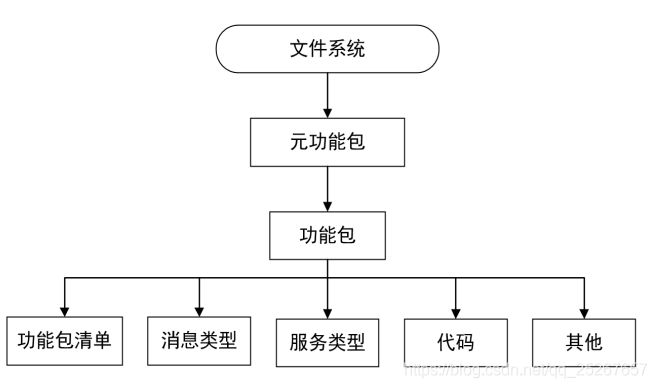

#### 开源社区层
