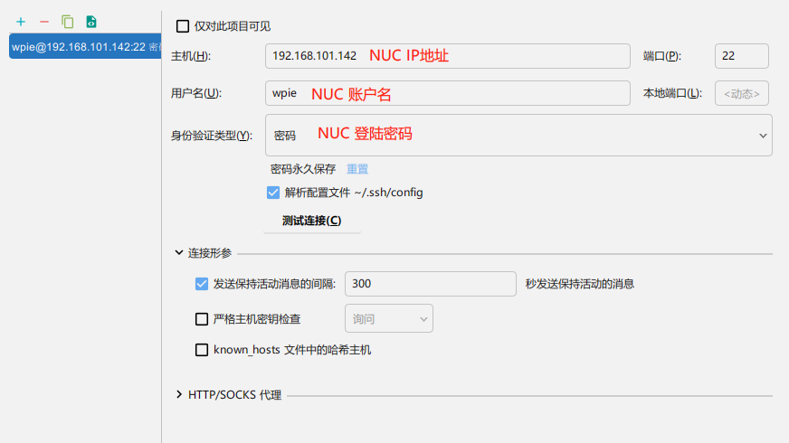
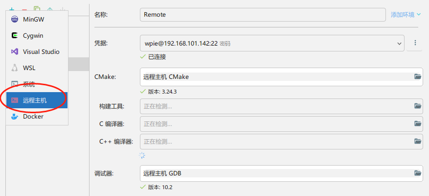
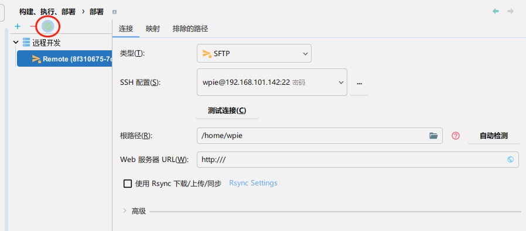
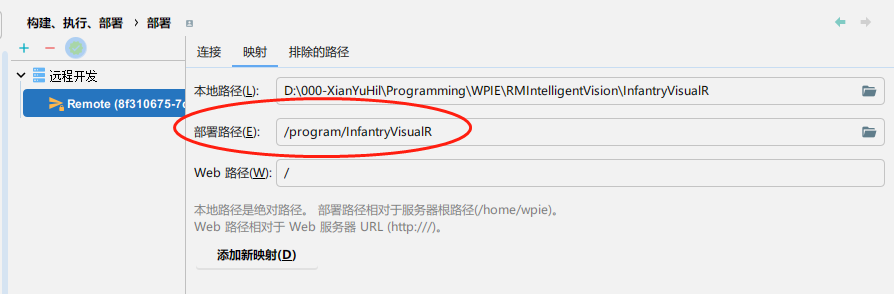
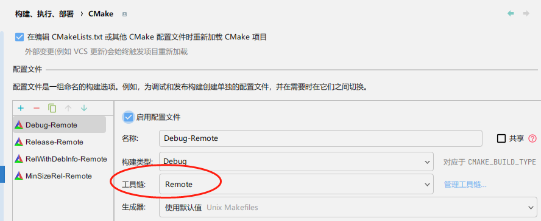
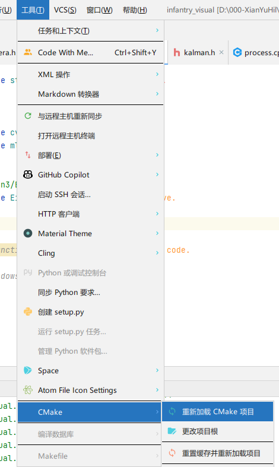
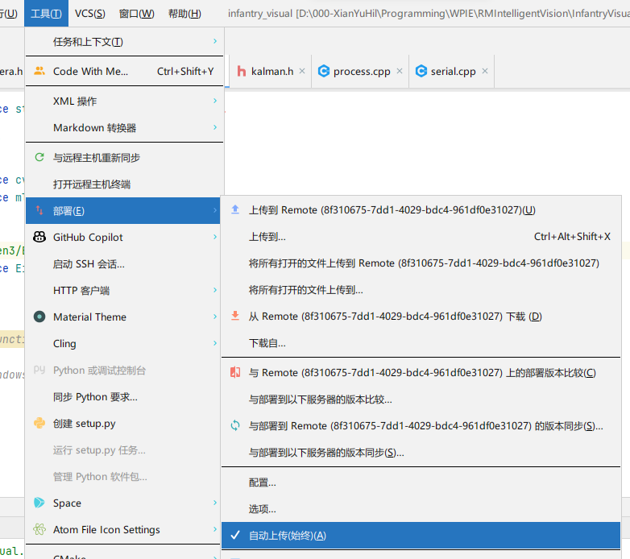

# Ubuntu 下配置 CLion 远程开发

- 在 Ubuntu 上安装所需软件包并放行防火墙

```bash
sudo apt install openssh-server
sudo ufw allow ssh
```

- 获取 NUC 的局域网 ip 地址

   可通过 `ip -a` 或 WLAN 设置页面
- 在 Windows 上的 CLion 客户端的 `设置->工具->SSH 配置` 中配置 SSH 服务器信息。并 "测试连接" 成功



- 在 `设置->构建、执行、部署->工具链` 中添加一个 `远程主机` 工具链。凭据选择为刚新建的 SSH 服务器，并应用设置。



- 在 `设置->构建、执行、部署->部署` 中应当自动添加并配置好了一个远程开发服务器。其中 `根路径`使用 `自动检测`，并将该远程开发作为 `默认值`



- 在 `映射`中填入远程服务器上的项目 `部署路径`



- 在 `设置->构建、执行、部署->CMake` 中将所有配置文件的 `工具链`均修改为 `Remote`



- 确定设置，并重新加载 CMake 项目。等待代码同步完成。



- 在 `工具->部署`中打开 `自动上传`



- 配置完成！在连接服务器的情况下，在 Windows 上进行的代码修改会自动同步到NUC上，而程序的代码分析、编译、运行和Debug等工作则会在NUC远程进行，Windows仅充当代码编辑的工具。当无法连接到服务器时，CLion会自动记录修改，并在下次连接时自动进行同步，也可手动进行代码上传。
