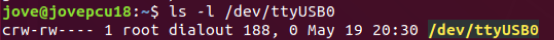
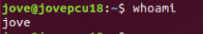

# 串口缺少权限修复

1. 查看串口所属用户组

```bash
ls -l /dev/ttyUSB0  #查看串口 ttyUSB0
```



可以看到串口 `ttyUSB0` 所属用户组为 `dialout`

2. 查看当前用户名

```bash
whoami
```



3. 将当前用户加入到串口所属用户组，使其拥有操作串口的权限。
```bash
sudo usermod -aG dialout jove
```


4. 重启系统