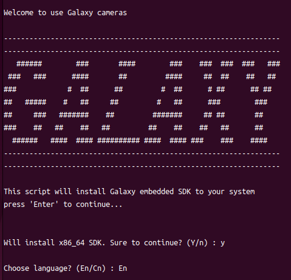

# Ubuntu 安装大恒相机驱动

- 前往 [官网下载中心](https://www.daheng-imaging.com/downloads/) 下载驱动安装包。
  - 目前我们使用的相机使用的基本均是 `Galaxy Linux-x86-Gige-U3 SDK_CN-EN`
- 解压下载得到的压缩包，并运行其中的 `Galaxy_camera.run`。

```bash
sudo ./Galaxy_camera.run
```

- 根据指引完成安装。



- 安装完成，重启。