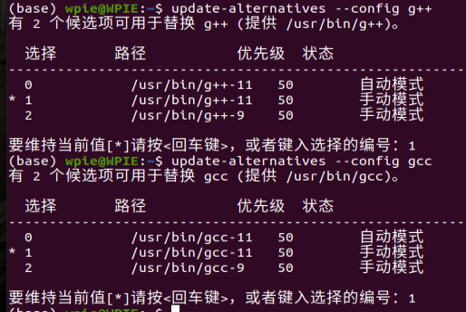
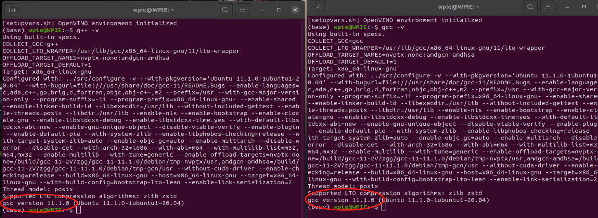

# Ubuntu 更新工具链

1. 添加测试版工具链源
```bash
add-apt-repository ppa:ubuntu-toolchain-r/test
```

2. 更新软件包列表
```bash
apt update
```

3. 安装g++11工具链
```bash
apt install g++-11
```

4. 检查安装结果
```bash
ls /usr/bin/gcc*
ls /usr/bin/g++*
```


5. 软件版本管理注册
```bash
update-alternatives --install /usr/bin/gcc gcc /usr/bin/gcc-9 50
update-alternatives --install /usr/bin/gcc gcc /usr/bin/gcc-11 50
update-alternatives --install /usr/bin/g++ g++ /usr/bin/g++-9 50
update-alternatives --install /usr/bin/g++ g++ /usr/bin/g++-11 50
```

6. 将新版本设置为默认版本
```bash
update-alternatives --config g++
update-alternatives --config gcc
```


7. 验证更新
```bash
g++ -v
gcc -v
```
