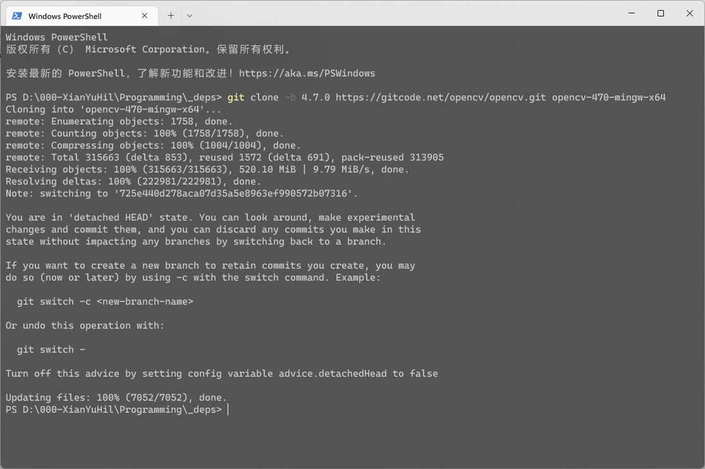
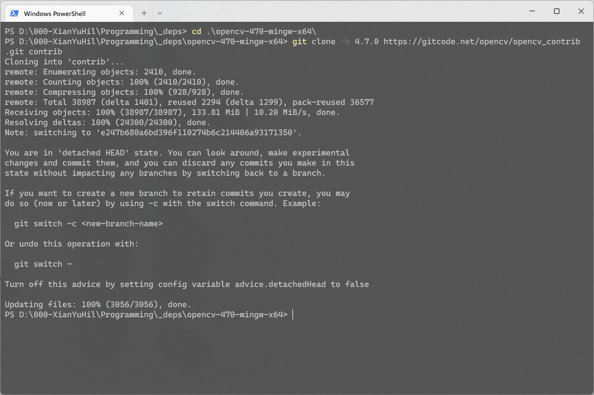
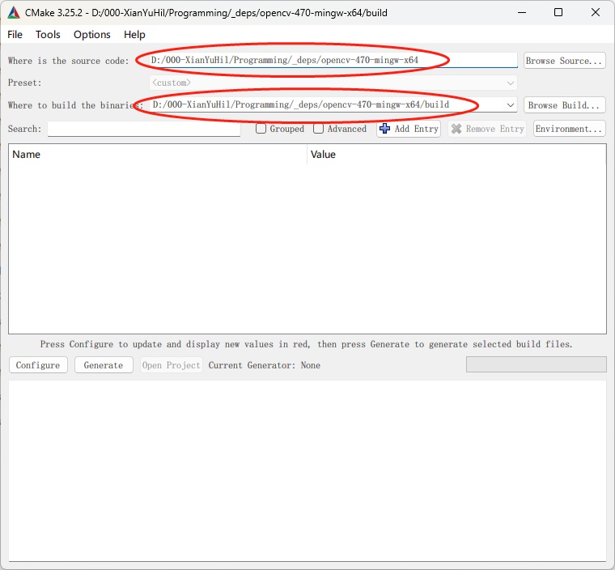
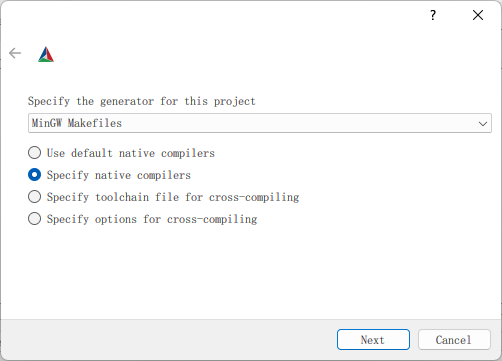
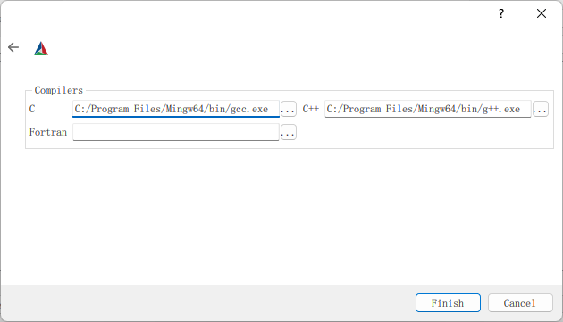
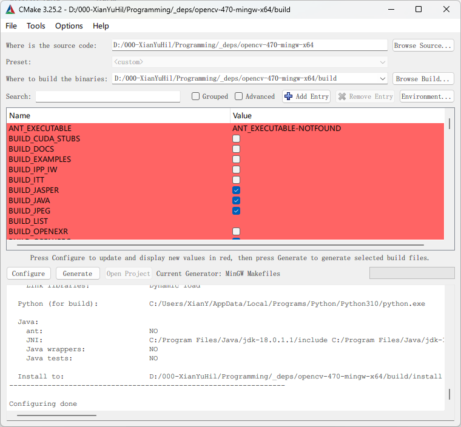
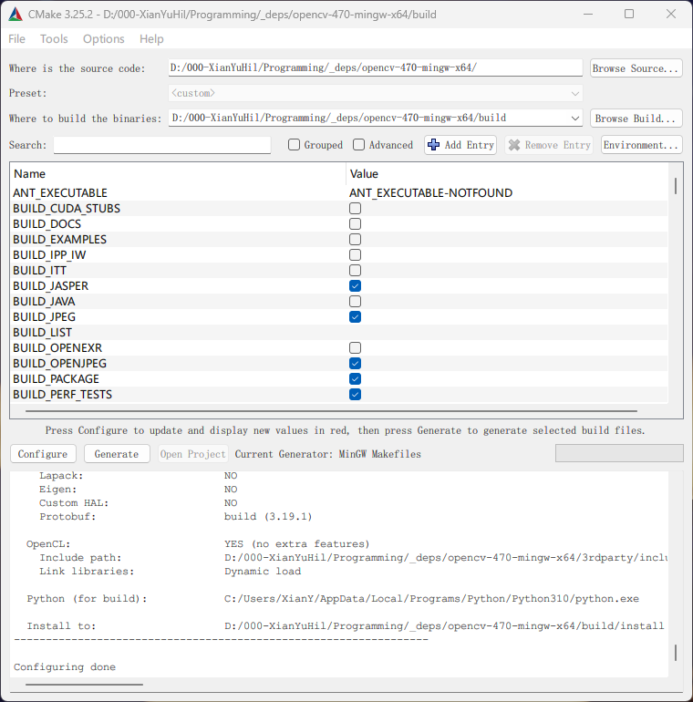
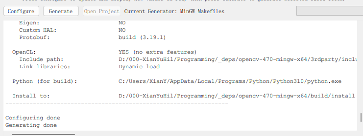

# Windows 使用 MinGW 编译 OpenCV + Contrib

此处使用官方的国内镜像，以解决各种无法连接外网导致的下载问题。

- OpenCV
  - https://gitcode.net/opencv/opencv
- OpenCV_Contrib
  - https://gitcode.net/opencv/opencv_contrib

1. 克隆OpenCV与OpenCV_Contrib的源代码。以下使用 `[OpenCV_DIR]` 来代指OpenCV的克隆目录。

   此处使用 `-b` 指定版本标签。

   `OpenCV_Contrib` 需克隆至 `[OpenCV_DIR]/contrib/` 目录内。

   
   
2. 在 `[OpenCV_DIR]` 下新建目录 `build` 。
3. 打开 `cmake-gui` ，并在相应位置填写好目录。

   
4. 点击 `Configure` ，使用的生成器选择为 `MinGW Makefiles` ，并手动指定相应的编译器。

   

   
5. 设置完成后，等待cmake进行configure。直到命令行输出显示 `Configuring done`。

   
6. 修改OpenCV编译选项。

   - 在 `OPENCV EXTRA MODULES PATH` 选项下填写OpenCV_Contrib地址 `[OpenCV_DIR]/contrib/modules`
   - 启用 `build_opencv_world` 、 `WITH_OPENGL` 、`WITH_OPENMP` 、`OPENCV_ENABLE_NONFREE`
   - 禁用 `WITH_IPP` 、`WITH_OPENCL_D3D11_NV` 、`WITH_QT` 、`BUILD_JAVA` 、`WITH_OBSENSOR` 、 `BUILD PERF TESTS` 、 `BUILD TESTS` 、 与Python相关的其他选项
   - 此处给出的编译选项设置仅为建议，具体可根据需求进行调整。OpenCV编译选项的介绍可参考https://blog.csdn.net/m0_66395189/article/details/122748163
7. 多次点击 `Configure` 。等待直到命令行输出显示 `Configuring done` 且上方编译选项条目没有红色。

   
8. 点击 `Gengerate` 。等待直到命令行输出显示 `Generating done` 。

   
9. 在 `[OpenCV_DIR]/build` 目录下执行 `mingw32-make.exe -j 12` ，并等待一段时间(大约30min)，直到编译工作全部完成。

   编译指令中的 `12` 为使用的并行CPU核心数，可以自行修改以提高编译效率。
10. 在 `[OpenCV_DIR]/build` 目录下执行 `mingw32-make.exe install` ，并等待安装工作全部完成。
11. 此时OpenCV的编译工作已全部完成！

    系统环境变量所配置的目录为 `[OpenCV_DIR]\build\install\x64\mingw\bin`

    `CMakeLists.txt` 中的 `OpenCV_DIR` 包含路径为 `[OpenCV_DIR]\build\install`
